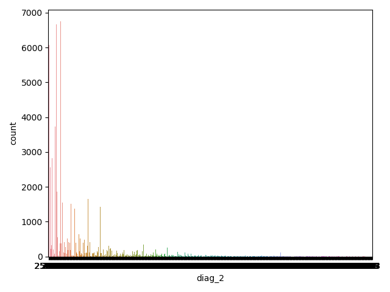
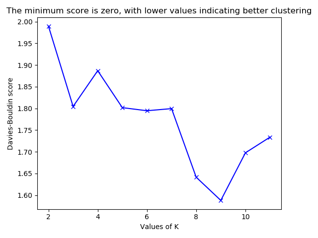

## Dataset

### Abstract

### Exploratory Data Analysis

A couples of observations are made

- `?` is used for `na` value
- some categorical are imbalanced:  `readmitted`, `a1Cresult`, `diag_1`, `diag_2`, `diag_3`
{width=25%} {width=25%} {width=25%} {width=25%}

###Types

| type   | count |
|--------|-------|
| int64  | 13    |
| object | 37    |

###Missing Values

| name              |   %    |
|-------------------|--------|
| race              | 2.234  |
| weight            | 96.858 |
| payer_code        | 39.557 |
| medical_specialty | 49.082 |
| diag_1            | 0.021  |
| diag_2            | 0.352  |
| diag_3            | 1.398  |

Looking at the missing values, I will:

 - drop columns: weight, payer_code. medical_speciality
 - drop na rows for diag_1, diag , diag_3, race 
 
 
##Variation 
 
  
 
###Data processing and feature engineering
 
- categorical fields into numerical: readmitted, age
- some numeric intro categorical: diag_1 , diag_2, diag_3
- categories with low counts (less than 1%) were remooed
-   

Kmean and DB-Scan perform well on numeric features as they need a distance between to points,  so I transformed as many as I could from categorical to numeric

- age ranges into - age median
- medications that were taken generated a sum of the meds 
-  
 
 
 
 
##Unsupervised Learning

###K-means 

K-means is a type of unsupervised learning and one of the popular methods of clustering unlabelled data into k clusters. One of the trickier tasks in clustering is identifying the appropriate number of clusters k.

**Evaluation metrics and choosing K**

Several metrics are used to choose K. 

- *Inertia* - Choose k such that adding another cluster will not explain the variance in data by much  
- *Davies-Bouldin score* [1](#myfootnote1)  -  average similarity measure of each cluster with its most similar cluster. The minimum score is zero, with lower values indicating better clustering.
- *Silhouette Coefficient* [2](#myfootnote2) -  the mean intra-cluster distance (a) and the mean nearest-cluster distance (b) for each sample. The best value is 1 and the worst value is -1. Values near 0 indicate overlapping clusters.

Looking at these tree graphs it looks that the best value for K  would be 3 or 4

{width=33%}  {width=33%} {width=33%} 

<a name="myfootnote1">1</a>. Davies, David L.; Bouldin, Donald W. (1979). “A Cluster Separation Measure”. IEEE Transactions on Pattern Analysis and Machine Intelligence. PAMI-1 (2): 224-227

. [Wikipedia entry on the Silhouette Coefficient](https://en.wikipedia.org/wiki/Silhouette_(clustering))

##DBSCAN

DBSCAN is data clustering algorithm that groups points which are closely packed together in feature space

###Hyperparameter tuning

 