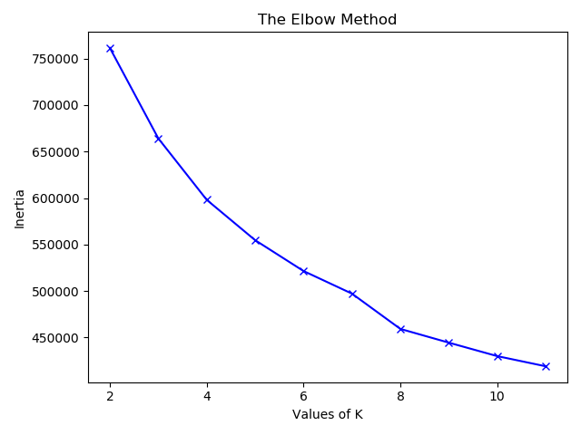
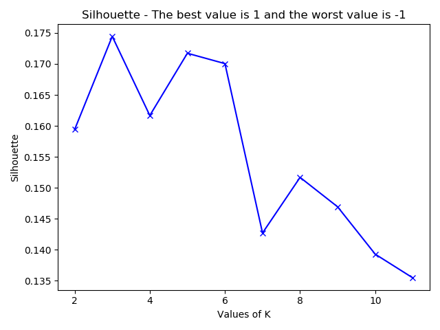

# Dataset

The dataset represents 10 years (1999-2008) of clinical care at 130 US hospitals and integrated delivery networks

## Abstract

It includes over 50 features representing patient and hospital outcomes. Information was extracted from the database for encounters that satisfied the following criteria.

- It is an inpatient encounter (a hospital admission).
- It is a diabetic encounter, that is, one during which any kind of diabetes was entered to the system as a diagnosis.
- The length of stay was at least 1 day and at most 14 days.
- Laboratory tests were performed during the encounter.
(5) Medications were administered during the encounter.
The data contains such attributes as patient number, race, gender, age, admission type, time in hospital, medical specialty of admitting physician, number of lab test performed, HbA1c test result, diagnosis, number of medication, diabetic medications, number of outpatient, inpatient, and emergency visits in the year before the hospitalization, etc.

## Exploratory Data Analysis

A couples of observations are made

- `?` is used for `na` value
- some categorical are imbalanced:  `readmitted`, `a1Cresult`, `diag_1`, `diag_2`, `diag_3`

{width=23%} {width=23%} {width=23%} {width=23%}

**Types**

| type   | count |
|--------|-------|
| int64  | 13    |
| object | 37    |

**Missing Values**

| name              |   %    |
|-------------------|--------|
| race              | 2.234  |
| weight            | 96.858 |
| payer_code        | 39.557 |
| medical_specialty | 49.082 |
| diag_1            | 0.021  |
| diag_2            | 0.352  |
| diag_3            | 1.398  |

Looking at the missing values, I will:

 - drop columns: weight, payer_code. medical_speciality
 - drop na rows for diag_1, diag , diag_3, race 
 
 
 
## Data processing and feature engineering
 
 
**Removal**  
- categorical fields into numerical: readmitted, age
- some numeric intro categorical: diag_1 , diag_2, diag_3
- categories with low counts (less than 1%) were removed
-   

**Tramsformation**

Kmean and DB-Scan perform well on numeric features as they need a distance between to points,  so I transformed as many as I could from categorical to numeric

- age ranges into - age median
- medications that were taken generated a sum of the meds 

For categorical features I reduced their unique values and after that LabeledEncoder and dummied  
 

**Class imbalance

Undersamples was used in order to unsample majority class using method `NearMiss`
 
 
Let's see how gender and readmition look:

{width=40%} {width=40%}  
 
 
# Unsupervised Learning

## K-means 

K-means is a type of unsupervised learning and one of the popular methods of clustering unlabelled data into k clusters. One of the trickier tasks in clustering is identifying the appropriate number of clusters k.

**Evaluation metrics and choosing K**

Several metrics are used to choose K. 

- *Inertia* - Choose k such that adding another cluster will not explain the variance in data by much  
- *Davies-Bouldin score* [1](#myfootnote1)  -  average similarity measure of each cluster with its most similar cluster. The minimum score is zero, with lower values indicating better clustering.
- *Silhouette Coefficient* [2](#myfootnote2) -  the mean intra-cluster distance (a) and the mean nearest-cluster distance (b) for each sample. The best value is 1 and the worst value is -1. Values near 0 indicate overlapping clusters.

Looking at these tree graphs it looks that the best value for K  would be 8

{width=33%}  {width=33%} {width=33%} 

{width=48%}  {width=48%}  

We plot data for 2-clusers and  8-cluster data

{width=48%}  {width=48%}  
{width=48%}  {width=48%}  

## DBSCAN

DBSCAN is data clustering algorithm that groups points which are closely packed together in feature space

**Choosing paramaters**

Epsilon should be choose somewhere between 0.5 and 1.5

{width=40%} {width=40%}

In order to understand the senitivity of epsilon I ploted then number of clusters:

{width=40%} 

epsi=1.5, k=3
{width=40%}

# Conclusions

The data set was not visible separable and I did not find any matching predictor that would be classified by unupervisded clusters these 

# References

<a name="myfootnote1">1</a>. Davies, David L.; Bouldin, Donald W. (1979). “A Cluster Separation Measure”. IEEE Transactions on Pattern Analysis and Machine Intelligence. PAMI-1 (2): 224-227

. [Wikipedia entry on the Silhouette Coefficient](https://en.wikipedia.org/wiki/Silhouette_(clustering))

